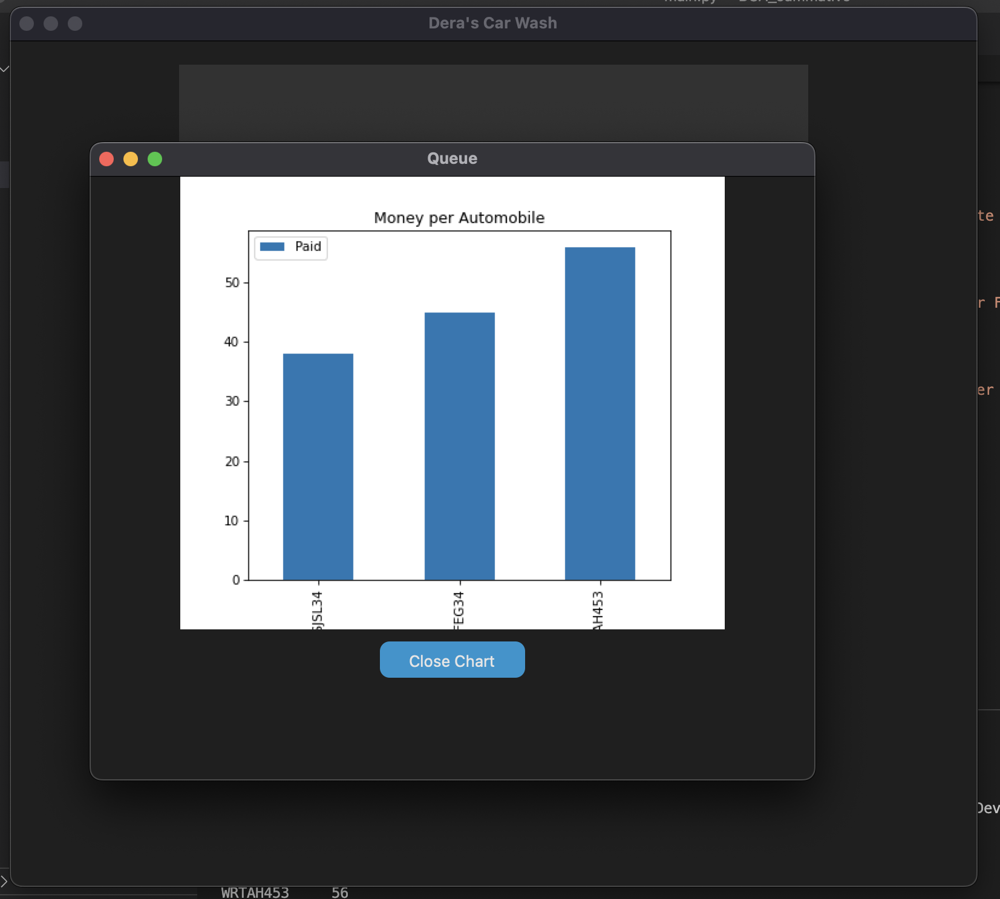

# DSA-carwash-management-system

Dera's Car Wash Management System is a simple app with a TKinter GUI.
It allows users to add cars to the queue, remove, check finances (of each car washed),
and exit the app with the data saved.


## Functionalities

### Home Screen of the application
Shows available options:


| _`main.py` running on Mac OS in dark mode

### Add Items To Queue
User can add cars to queue by entering plate number, customer name and amount paid.


| _`main.py` adding an item to queue

### Manage Queue
User can go through the items on the queue via the GUI. Shows an error if user tries
to manage empty queue.


| _`main.py` adding an item to queue


| _`main.py` queue error accessing empty queue

### View Finances
The view finances allows user select a previously saved session and brings a chart of their finance. 
If the chosen file doesn't follow the .csv format it shows an error.


| _`main.py` bar chart for finances using matplotlib


| _`main.py` bar chart for finances using matplotlib

### Remove Automobile
The app also provides an option to remove the next item in the queue and move the next to it's place.


## Requirements to run main.py
Install the customtkinter with pip:
```
pip3 install customtkinter
```
**Update existing installation:** ```pip3 install customtkinter --upgrade```\
(update as often as possible because this library is under active development)
